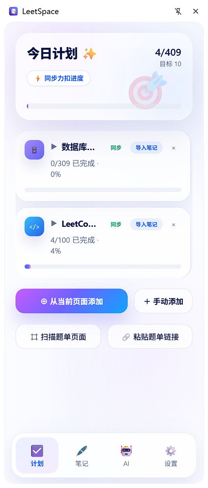
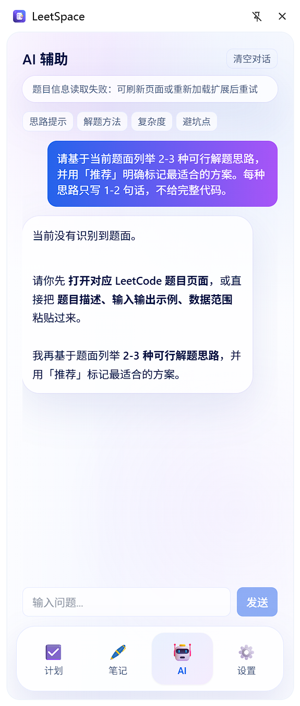
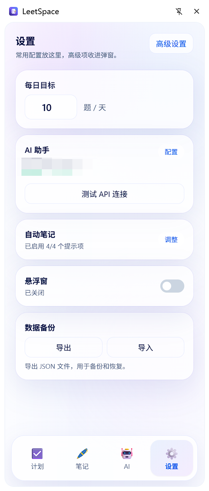
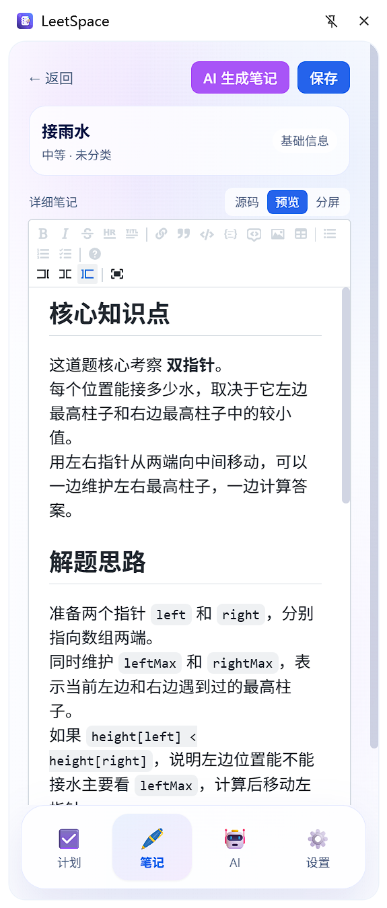
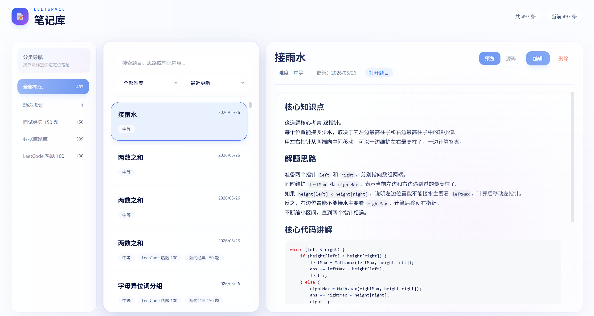

# LeetSpace

<p align="center">
  
</p>

<h3 align="center">把 LeetCode / 力扣变成一个真正好用的刷题工作台</h3>

<p align="center">
  <strong>题单计划 · 进度同步 · Markdown 笔记 · AI 解题提示 · 做题计时</strong>
</p>

<p align="center">
  <a href="https://github.com/ban-code-art/LeetSpace/releases/tag/v0.1.0"></a>
  
  
  
  <a href="LICENSE"></a>
</p>

<p align="center">
  <a href="#-核心能力">核心能力</a> ·
  <a href="#-界面预览">界面预览</a> ·
  <a href="#-安装方式">安装方式</a> ·
  <a href="#-ai-配置">AI 配置</a> ·
  <a href="#-常见问题">常见问题</a>
</p>

---

## ✨ 这是什么？

LeetSpace 是一个面向 **LeetCode / 力扣** 的 Chrome 侧边栏插件。它不是单纯的题目收藏夹，而是把刷题过程中最容易割裂的几个动作串起来：

- 从力扣页面导入题单，形成可折叠的刷题计划。
- 自动同步已通过题目，避免手动勾选进度。
- 给每道题建立 Markdown 笔记，把思路、代码、复盘沉淀下来。
- 在题目页自动识别当前题目信息，让 AI 给出简洁、实用、偏面试视角的解题提示。
- 用悬浮计时器记录做题时间，让刷题过程更有节奏。

如果你正在刷 Hot100、代码随想录、灵茶题单、企业高频题，LeetSpace 可以帮你把“刷题列表、完成状态、解题笔记、AI 提示、耗时记录”放进同一个工作流。

---

## 🚀 核心能力

<table>
  <tr>
    <td width="50%">
      <h3>📚 题单导入与分组计划</h3>
      <p>支持从当前力扣页面扫描题单，也支持粘贴题单链接导入。不同题单会独立存放，不会混在一个臃肿列表里。</p>
      <ul>
        <li>题单自动分组</li>
        <li>重复题单防导入</li>
        <li>大题单折叠展示</li>
        <li>按全部题单或单个题单查看进度</li>
      </ul>
    </td>
    <td width="50%">
      <h3>✅ 力扣进度同步</h3>
      <p>读取力扣账号中的题目 AC 状态，把已经完成的题目同步回插件。提交通过后，也会尝试自动更新本地计划。</p>
      <ul>
        <li>同步 LeetCode / 力扣已 AC 状态</li>
        <li>通过提交后自动标记完成</li>
        <li>减少手动维护计划成本</li>
        <li>适合长期刷题追踪</li>
      </ul>
    </td>
  </tr>
  <tr>
    <td width="50%">
      <h3>📝 Markdown 笔记系统</h3>
      <p>每道题都可以关联笔记，支持源码和渲染预览切换。题单中的题目也可以批量导入为笔记分类。</p>
      <ul>
        <li>最近笔记快速查看</li>
        <li>完整笔记库独立窗口</li>
        <li>Markdown 源码 / 预览切换</li>
        <li>按题单分类沉淀题解</li>
      </ul>
    </td>
    <td width="50%">
      <h3>🤖 AI 自动识题辅助</h3>
      <p>进入题目页后，AI 会自动识别当前题目的标题、难度、标签和题干，直接生成简洁有效的算法提示。</p>
      <ul>
        <li>自动读取当前题目信息</li>
        <li>多种解法思路对比</li>
        <li>标记推荐企业级方案</li>
        <li>输出复杂度和避坑点</li>
      </ul>
    </td>
  </tr>
  <tr>
    <td width="50%">
      <h3>⏱️ 悬浮做题计时器</h3>
      <p>在力扣页面显示轻量悬浮窗，可以播放、暂停和重置计时，辅助记录一道题的真实思考时间。</p>
      <ul>
        <li>播放 / 暂停 / 重置</li>
        <li>页面内轻量悬浮</li>
        <li>可拖拽调整位置</li>
        <li>辅助复盘做题效率</li>
      </ul>
    </td>
    <td width="50%">
      <h3>⚙️ 简洁设置与高级配置</h3>
      <p>基础设置保持清爽，高级 API、提示词、自动笔记等配置收纳在高级设置中，避免设置页过度臃肿。</p>
      <ul>
        <li>基础设置页</li>
        <li>高级设置弹窗</li>
        <li>自定义 AI Provider</li>
        <li>本地保存敏感配置</li>
      </ul>
    </td>
  </tr>
</table>

---

## 🖼️ 界面预览

<p align="center">
  
</p>

<p align="center">
  <strong>侧边栏主工作台：计划、进度、笔记、AI 和计时都在这里开始。</strong>
</p>

<table>
  <tr>
    <td width="50%" align="center">
      
      <br />
      <strong>题单管理</strong>
      <br />
      <sub>题单导入、分组存放、折叠管理、进度统计</sub>
    </td>
    <td width="50%" align="center">
      
      <br />
      <strong>笔记系统</strong>
      <br />
      <sub>最近笔记、Markdown 编辑、题目关联</sub>
    </td>
  </tr>
  <tr>
    <td width="50%" align="center">
      
      <br />
      <strong>AI 辅助</strong>
      <br />
      <sub>自动识别题目，输出简洁算法提示</sub>
    </td>
    <td width="50%" align="center">
      
      <br />
      <strong>完整笔记库</strong>
      <br />
      <sub>新窗口查看、编辑、分类和预览全部笔记</sub>
    </td>
  </tr>
</table>

---

## 🧭 适合哪些场景？

| 场景 | LeetSpace 能帮你做什么 |
| --- | --- |
| 刷 Hot100 / 面试高频题 | 导入题单，按完成状态推进，不再靠收藏夹记忆。 |
| 系统刷算法专题 | 按题单分类沉淀笔记，复盘时可以按分类查看。 |
| 不知道题目怎么入手 | AI 自动读取题目，给出多种思路，并标出推荐方案。 |
| 想记录真实做题时间 | 用悬浮计时器记录耗时，复盘哪些题卡得久。 |
| 做完题后想长期维护 | 自动同步 AC 状态，把刷题计划和真实力扣进度对齐。 |

---

## 📦 安装方式

目前 LeetSpace 主要通过 **Chrome 开发者模式** 安装，支持两种方式：

- 普通用户：下载 Release 中已经打包好的插件文件。
- 开发者：拉取源码，本地构建后加载 `dist/`。

### 方式一：下载 Release 安装（推荐普通用户）

这是最简单的安装方式，不需要安装 Node.js，也不需要自己构建项目。

1. 打开项目的 Release 页面：

   <https://github.com/ban-code-art/LeetSpace/releases>

2. 找到最新版本，例如 `LeetSpace v0.1.0`。

3. 在 `Assets` 区域下载插件压缩包，例如：

   ```text
   leetspace-v0.1.0.zip
   ```

4. 把下载到的 zip 文件解压到一个固定目录，例如：

   ```text
   D:\ChromeExtensions\LeetSpace
   ```

   > 不建议解压到下载目录后又删除文件。Chrome 加载的是这个本地目录，目录删除后插件也会失效。

5. 打开 Chrome 扩展管理页：

   ```text
   chrome://extensions/
   ```

6. 打开右上角的 **开发者模式**。

7. 点击 **加载已解压的扩展程序**。

8. 选择刚刚解压出来的插件目录。

   正确目录中通常能看到 `manifest.json` 文件。

9. 安装完成后，打开：

   ```text
   https://leetcode.cn/
   ```

   或：

   ```text
   https://leetcode.com/
   ```

10. 点击浏览器工具栏中的 LeetSpace 图标，或打开 Chrome 侧边栏使用插件。

### 方式二：源码构建安装（推荐开发者）

如果你想二次开发、修改代码或本地调试，可以从源码构建。

#### 环境要求

- Node.js：`^20.19.0` 或 `>=22.12.0`
- npm：随 Node.js 安装即可
- Chrome / Edge：支持 Manifest V3 和 Side Panel 的较新版本

#### 构建步骤

```bash
git clone https://github.com/ban-code-art/LeetSpace.git
cd LeetSpace
npm install
npm run build
```

构建完成后，项目根目录会生成：

```text
dist/
```

然后进入 Chrome 扩展管理页：

```text
chrome://extensions/
```

打开 **开发者模式**，点击 **加载已解压的扩展程序**，选择项目下的 `dist/` 目录。

> 注意：源码安装时不要直接选择项目根目录，必须选择构建后的 `dist/` 目录。

#### 开发模式

开发时可以运行：

```bash
npm run dev
```

该命令会监听源码变化并持续构建到 `dist/`。修改代码后，通常需要在 `chrome://extensions/` 中点击插件的刷新按钮，让 Chrome 重新加载最新构建产物。

---

## 🤖 AI 配置

LeetSpace 不内置固定 AI 服务，你需要配置自己的 API。

1. 打开 LeetSpace 侧边栏。
2. 进入 **设置**。
3. 点击 **高级设置**。
4. 配置以下信息：
   - Provider
   - API Key
   - Model
   - Base URL
5. 点击测试 API 连接，确认可用后保存。

AI 功能会自动读取当前力扣题目的上下文，然后生成：

- 多种解题思路。
- 推荐方案标记。
- 核心算法解释。
- 时间复杂度和空间复杂度。
- 常见坑点。
- 适合写入笔记的精简总结。

> API Key 只会保存在浏览器本地的 `chrome.storage.local`，不会提交到 GitHub，也不会被项目服务端收集。

---

## 🧩 使用流程示例

### 导入一个题单

1. 打开力扣题单页面，例如 Hot100 或某个学习计划。
2. 打开 LeetSpace 侧边栏。
3. 进入题单管理或今日计划相关区域。
4. 选择从当前页面扫描，或粘贴题单链接导入。
5. 导入成功后，题目会按题单分组展示。

### 给题单建立笔记

1. 在计划页找到某个题单。
2. 使用批量导入笔记功能。
3. 插件会为题单中的题目创建笔记条目。
4. 笔记分类默认使用题单名称。
5. 后续可以在完整笔记库中按分类查看。

### 在题目页使用 AI

1. 打开一道 LeetCode / 力扣题目。
2. 打开 LeetSpace 的 AI 辅助。
3. 点击思路提示、解题方法、复杂度分析等快捷按钮。
4. AI 会基于当前题目生成简洁结果。
5. 你可以把关键内容整理到题目笔记里。

---

## 🔐 权限说明

| 权限 | 用途 |
| --- | --- |
| `sidePanel` | 显示 Chrome 侧边栏主界面。 |
| `storage` | 保存计划、笔记、AI 配置、计时器和界面偏好。 |
| `activeTab` | 读取当前正在访问的力扣页面信息。 |
| `tabs` | 打开完整笔记库页面、识别当前标签页。 |
| `https://leetcode.cn/*` | 扫描力扣中文站题目、题单和同步完成状态。 |
| `https://leetcode.com/*` | 扫描 LeetCode 国际站题目、题单和同步完成状态。 |

---

## 🛡️ 数据与隐私

- 插件数据默认保存在浏览器本地。
- AI API Key 保存在 `chrome.storage.local`。
- 项目没有自建服务器，不会主动收集你的刷题数据。
- AI 请求会发送到你自己配置的模型服务，请根据对应服务商的隐私政策使用。
- 力扣进度同步依赖当前浏览器登录态，插件不会保存你的力扣账号密码。

---

## 🛠️ 技术栈

| 模块 | 技术 |
| --- | --- |
| 插件框架 | Chrome Manifest V3、Side Panel、Content Script、Background Service Worker |
| 前端 | React、TypeScript、Tailwind CSS |
| 状态管理 | Zustand |
| Markdown | `@uiw/react-md-editor` |
| 构建 | Vite、CRXJS |

---

## ❓ 常见问题

### 为什么加载源码根目录不生效？

Chrome 扩展需要加载构建后的插件目录。源码项目需要先执行：

```bash
npm run build
```

然后在 Chrome 中加载 `dist/`，而不是项目根目录。

### Release 里面下载 zip 后应该选择哪个目录？

下载 `leetspace-v0.1.0.zip` 后先解压，然后选择解压后的目录。这个目录里应该能看到 `manifest.json`。

### 为什么没有扫描到题单？

可以尝试以下操作：

1. 确认当前页面是力扣题单、学习计划或题目列表页面。
2. 确认页面内容已经加载完成。
3. 刷新页面后重新打开侧边栏扫描。
4. 如果页面结构被力扣更新，可以改用粘贴题单链接导入。

### 为什么已完成题目没有同步？

进度同步依赖力扣账号登录态和题目的 AC 状态。请确认：

1. 浏览器已经登录 `leetcode.cn` 或 `leetcode.com`。
2. 你完成题目的站点和插件同步的站点一致。
3. 题目在力扣上显示为已通过。
4. 同步后刷新插件侧边栏查看状态。

### AI 为什么不能使用？

请检查：

1. API Key 是否填写正确。
2. Base URL 是否匹配你的模型服务。
3. Model 名称是否可用。
4. 当前网络是否能访问该模型服务。
5. 是否已经在高级设置中保存配置。

---

## 📌 发布说明

当前版本主要面向开发者模式安装使用。如果后续发布到 Chrome Web Store，还需要准备：

- 隐私政策页面。
- 商店宣传图和截图。
- 权限用途说明。
- 商店审核用压缩包。

---

## 🤝 贡献

欢迎提交 Issue 或 Pull Request，例如：

- 新的题单页面适配。
- 更好的 AI 提示词。
- 更多笔记模板。
- 更细的进度统计。
- 更漂亮的主题样式。

---

## 📄 License

本项目基于 [MIT License](LICENSE) 开源。
